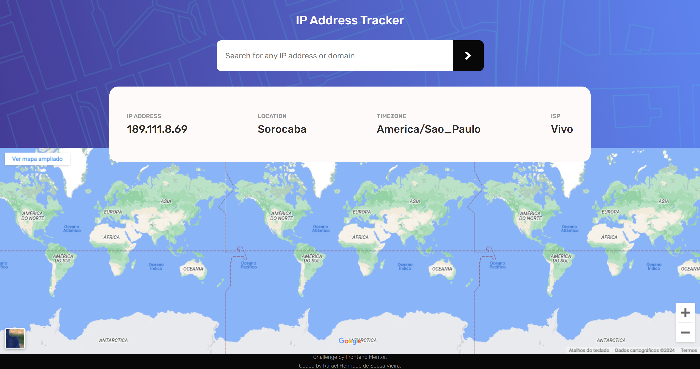
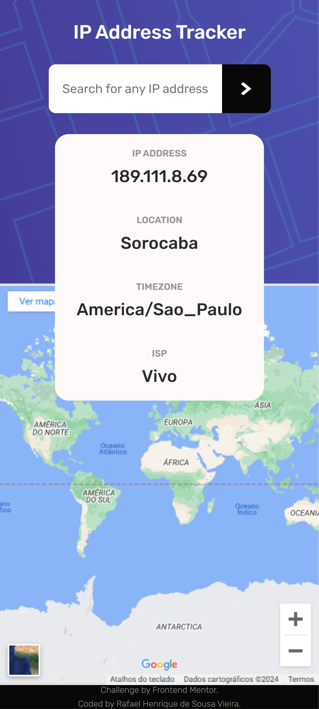

# Frontend Mentor - IP address tracker solution

> This is a solution to the [IP address tracker challenge on Frontend Mentor](https://www.frontendmentor.io/challenges/ip-address-tracker-I8-0yYAH0). Frontend Mentor challenges help you improve your coding skills by building realistic projects.

## Table of contents

-    [Overview](#overview)
     -    [The challenge](#the-challenge)
     -    [Links](#links)
     -    [Screenshot](#screenshot)
-    [My process](#my-process)
     -    [Built with](#built-with)

## Overview

### The challenge

Users should be able to:

-    View the optimal layout for each page depending on their device's screen size
-    See hover states for all interactive elements on the page
-    See their own IP address on the map on the initial page load
-    Search for any IP addresses or domains and see the key information and location

### Links

-    Solution URL: URL SOLUTION HERE
-    Live Site URL: URL SITE HERE

### Screenshot

-    Desktop

     

-    Mobile

     

## My process

### Built with

-    HTML
-    CSS
-    JAVASCRIPT
-    API
-    GOOGLE MAPS
-    IP API

[⬆ Back to the top](#frontend-mentor---ip-address-tracker-solution)
 
